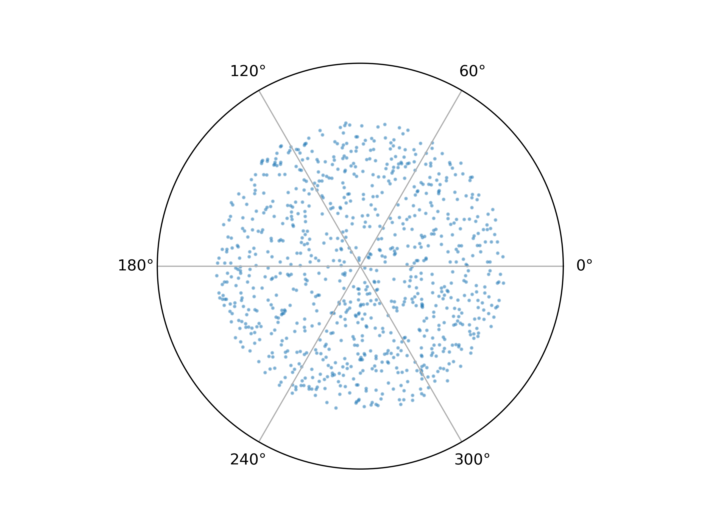
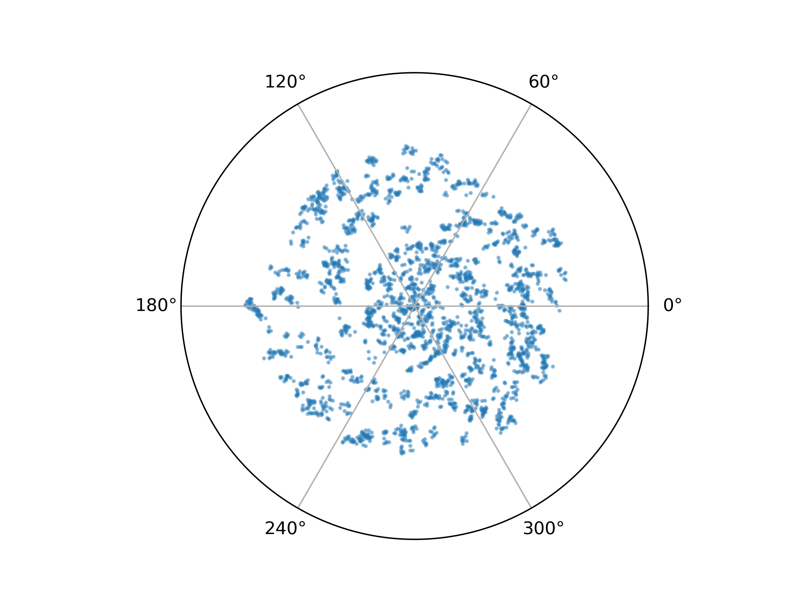

# Galactic-MCMC

A small repo examining a result from [Yoshino and Sagawa (2008)](https://www.worldscientific.com/doi/abs/10.1142/S0218348X08003922) modelling the formation of galaxies using a Markov Chain Monte Carlo (MCMC) method

